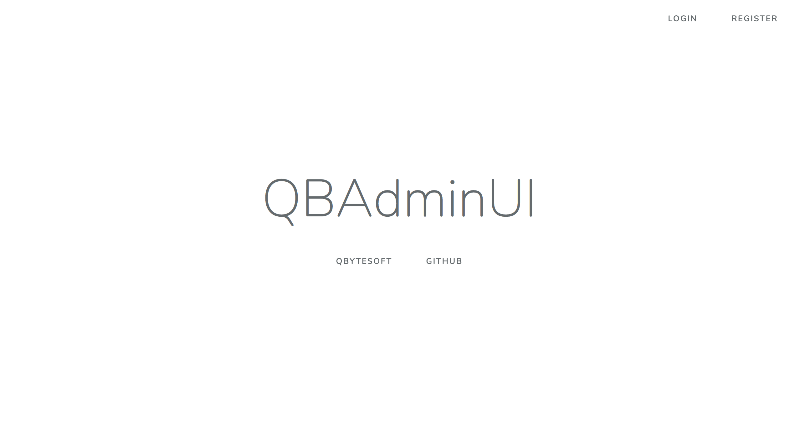
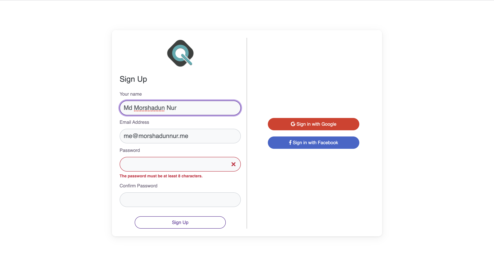
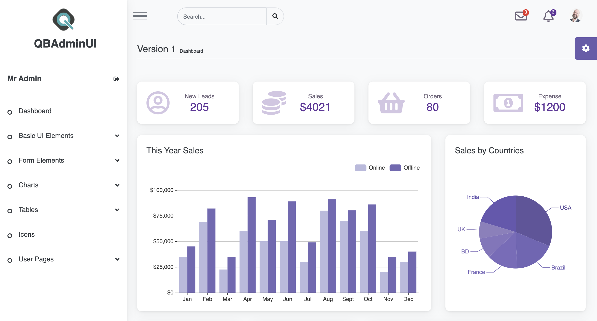

<h1 align="center">MCMC Asset & Gift System</h1>


## About MCMC Asset & Gift System

MCMC Asset & Gift System use the QBAdminUI template. QBAdminUI is a free html template. Here this is a laravel broilerplate to start with this admin dashboard. We use the Laravel Framework default authentication system.

- [HTML Demo](https://qbytesoft-com.github.io/qbadminui/).
- [Laravel Demo](https://qbadminui.qbytesoft.com).


## Installation

1. Install

``` bash
$ composer Install
$ npm install
```
2. Build with NPM
``` bash
$ npm run dev
```
3. Create a .env file
4. Setup Database Name
5. Migrate the tables
``` bash
$ php artisan key:generate
$ php artisan migrate
```
It's Done

#### Welcome Screen

#### Sign UP Screen

#### Sign In Screen

#### Home Screen



## License

The QBAdminUI Laravel Broilerplate is open-sourced software licensed under the [MIT license](https://opensource.org/licenses/MIT).
